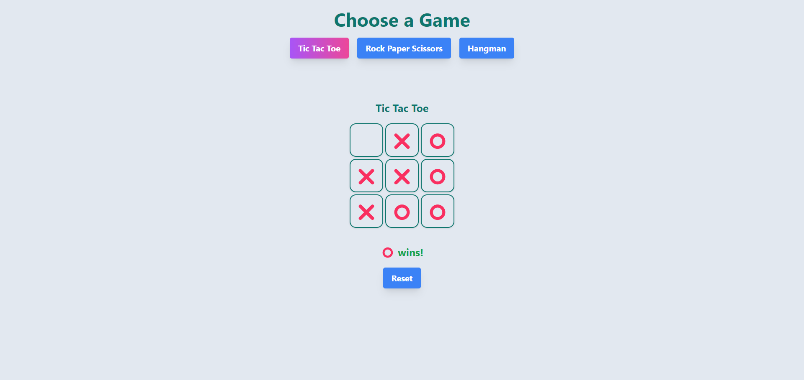
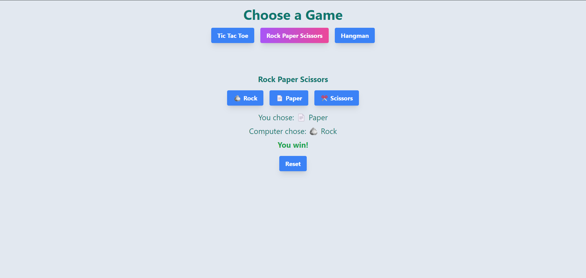
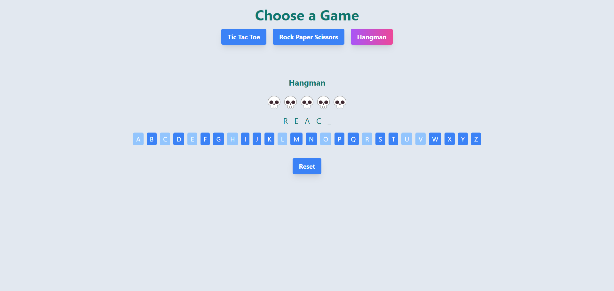

# SEC React + Tailwind Workshop
[**Live Demo**](https://dev.d1f8m2zsjtykq5.amplifyapp.com/)

Simple React webpage for Tic Tac Toe, Rock Paper Scissors, and Hangman. Created for **UF Software Engineering Club's** Spring 2024 React + Tailwind Workshop.

[**Workshop Recording**](https://www.youtube.com/watch?v=xBPBlIDLyXo&ab_channel=UFSoftwareEngineeringClub)

[**Instruction Document**](https://docs.google.com/document/d/172SOIx3-Dt_ICFWEvVisyZxn9TjdWb6DUrs34ckhtuM/edit)

# Functions
### Tic Tac Toe

### Rock Paper Scissors

### Hangman


# Quickstart
1. Clone the repository to your machine.
```bash
git clone https://github.com/saurabhanand03/sec-react-tailwind-workshop
cd sec-react-tailwind-workshop
```
2. Install all dependencies.
```bash
npm install
```
3. Run app in development mode.
```bash
npm start
```